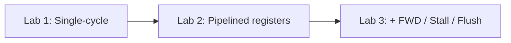

# WHU Computer Organization Course Design — Labs Overview (English)

This repository supports the **Computer Organization** course design at **Wuhan University (WHU)**, **RISC-V–style** datapaths implemented in **Verilog**. The tree contains **three successive CPU projects**: a **single-cycle** processor, a **basic five-stage pipeline** without hazard hardware, and a **full pipeline** with **stalling, flushing, and forwarding**.

This document is for readers who know nothing about the assignment: **what each milestone is** and **what the hardware is supposed to do**. It does **not** explain RTL implementation details. It does **not** reproduce informal student-guide text (class sections, instructor nicknames, contact info, or oral-exam anecdotes) from `README.md`.

**Important:** Your instructor may change the **instruction encoding**, **validation programs**, or **I/O / display** requirements by year or section—always follow the **official handout** and **Task PDFs** if they differ from this repo.

---

## Common technical context

- **Language:** Verilog modules (`*.v`).
- **ISA flavor:** A **subset** of **RV32I-like** operations, decoded from a **5-bit `opcode` field** in the provided `Controller` (examples named in code: `add`, `addi`, `sub`, logical and shifts, `lui`, `lw`/`sw`, branches `blt`/`beq`, `jal`/`jalr`). The **exact bit layout** of instructions is course-specific; you implement control and datapath to match your spec.
- **Platform (typical):** FPGA board with **clock**, **reset**, **switches**, and **7-segment displays**. The top-level `Computer` modules often mux a **fast** vs **divided (slow) clock** and mux **what** is shown on the display (e.g. **PC** vs **result**), using **switch** inputs—details vary by board wiring.

---

## Lab 1 — Single-cycle CPU (`Single_Cycle/`)

**Goal:** Implement a **complete single-cycle** RISC-V subset CPU: **one clock cycle per instruction**, end-to-end from **fetch** through **write-back**.

**What you build (structurally):** Datapath blocks such as **PC**, **instruction memory**, **register file**, **immediate generator**, **ALU** with muxed inputs, **data memory**, **PC/next-address mux** (sequential PC, branch, jump, etc.), **main controller** producing register/write/memory/ALU control signals, and a **top-level** `Computer` tying them to **clock/reset** and **I/O** for observation.

**What it must do functionally:** Execute the **test program** burned into `IMem` (and use `DMem` as required). A classic demo described in the course guide is **summing integers 1…100** and placing the result in a register shown on the display (e.g. **0x5050** in hexadecimal for that sum). You can **single-step** behavior by slowing the clock or observing **PC** on the display, depending on switches.

**Outcome:** Correct final **arithmetic result** and plausible **PC progression** consistent with a single-cycle machine.

---

## Lab 2 — Basic pipelined CPU (`Basic_Pipeline/`)

**Goal:** Extend the design to a **5-stage pipeline** (**IF → ID → EX → MEM → WB**) using **pipeline registers** (`IFIDReg`, `IDEXReg`, `EXMEMReg`, `MEMWBReg`), **without** the extra **hazard-detection / forwarding** units.

**What you build:** The same functional units as Lab 1, split across stages with **registered** interfaces; **branch/jump** resolution and **PC** update occur in the pipeline timing implied by your diagram (often **branch decision in MEM**, affecting the next **IF** address).

**What it must do functionally:** Run a **longer** program—commonly **bubble sort** of a small array in **data memory**, initialized in-place then sorted. **Expected visible result:** sorted values (e.g. **1…10**) on the display when the program completes; with a **slow clock**, you may watch values change. **PC** display can look **stable or “cycling”** near the end because of how the **endless wait loop** (e.g. self-branch) interacts with which pipeline stage drives the displayed PC—your instructor may or may not ask about this.

**Caveat:** Without forwarding/stall logic, **hazardous instruction sequences** must be avoided or the program must be written so it still works under the simplified hardware—per your course’s assembly rules.

---

## Lab 3 — Full pipelined CPU with hazards (`Final_Pipeline/`)

**Goal:** Add **structural hazard handling** typical of a taught MIPS/RISC-V pipeline course:

- **Forwarding** (`FWD`, `FWDMUX`) to reduce **data hazards** by muxing **ALU/register inputs** from EX/MEM/WB stages.
- **Stall** logic (`Stall`) for **load-use** and similar cases that forwarding alone cannot fix.
- **Flush** logic (`Flush`) for **control hazards** when branches/jumps are resolved (pipeline bubbles / invalidating early stages).

**What you build:** Lab 2’s pipeline **plus** these units integrated in `Computer.v`, preserving correct **register write timing** and **memory** behavior.

**What it must do functionally:** Run a **Fibonacci** (or similar) benchmark program from instruction memory. A typical expected **final displayed result** is the **n-th Fibonacci value** required by the handout (e.g. **21** decimal, shown as **0x15** on hex displays—**verify against your PDF**). As in Lab 2, **PC** may appear to **loop** in the idle wait state after completion.

**Outcome:** Correct outputs under programs that **stress** dependencies and branches—things the basic pipeline cannot handle without hazard hardware.

---

## How the three labs relate

Each step **reuses concepts** (ALU, regfile, memories, control) but increases **timing overlap** and **complexity** of control.

---

## Repository layout (quick reference)

| Directory | Role |
|-----------|------|
| `Single_Cycle/` | Single-cycle datapath + top |
| `Basic_Pipeline/` | 5-stage pipeline, no hazard units in this tree |
| `Final_Pipeline/` | 5-stage pipeline + forwarding + stall + flush |

---

## What this overview does **not** include

- **Bit-accurate instruction formats** and **assembly-to-machine-code** translation tables (section-specific).
- **Switch numbers** and **board pinouts** (verify in your `Computer.v` and lab manual).
- **Grading rubrics** or **oral exam** questions.

---

*Derived from module names, `Controller.v` opcode list, and top-level connectivity only. If the upstream GitHub adds `Task/` PDFs, use them as the authoritative spec.*
